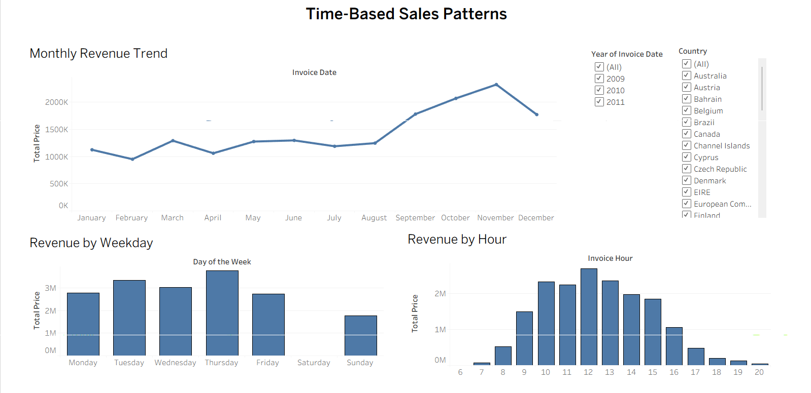
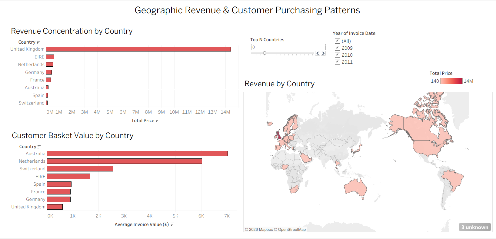
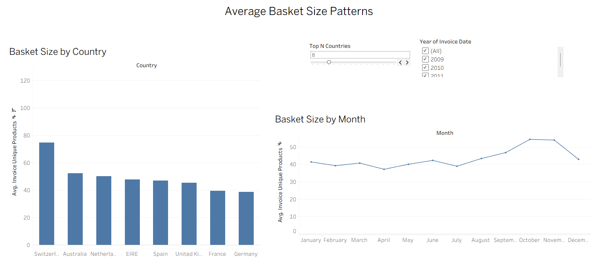
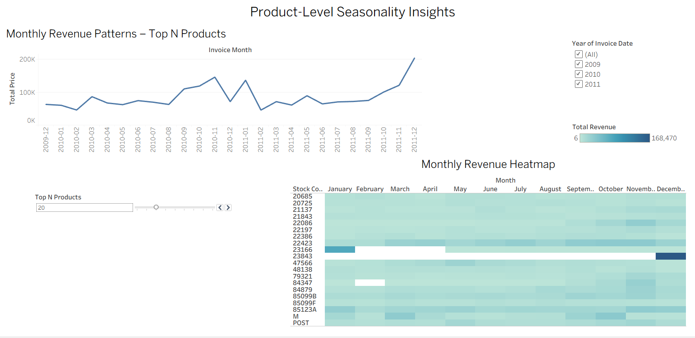

# Tableau Dashboards — Insights & Interpretation  
Retail Basket Dynamics

This document explains the Tableau dashboards created for the **Retail Basket Dynamics** project.  
It focuses on **how to read each dashboard, what metrics are used, and what insights can be derived**.

The dashboards are designed to complement Python-based analysis by enabling interactive exploration of time, geography, basket behavior, and product seasonality.

---

## Dashboard 1 — Time-Based Sales Patterns

### Business Question  
**What time-based patterns affect sales (hour, weekday, month)?**

### Metrics Used
- Total Revenue (`SUM(Total Price)`)

### Filters
- Year
- Country

### Visuals and Interpretation

#### Monthly Revenue Trend
A line chart showing total revenue aggregated by month.

- Reveals seasonal patterns in sales.
- Makes it easy to compare performance across years using the year filter.
- Highlights months with consistently higher or lower revenue.

#### Revenue by Weekday
A bar chart comparing revenue across weekdays.

- Shows how sales are distributed during the week.
- Helps identify high-performing and low-performing days.

#### Revenue by Hour
A bar chart showing revenue by invoice hour.

- Highlights peak business hours.
- Useful for understanding when most purchasing activity occurs.

### Key Insights
- Revenue is concentrated during standard business hours.
- Weekdays outperform weekends in terms of total revenue.
- Monthly trends show clear seasonality, with stronger performance toward the end of the year.

### How This Dashboard Helps
- Supports operational planning (staffing, logistics).
- Helps marketing teams time promotions.
- Provides context for seasonal demand planning.

---

## Dashboard 2 — Geographic Revenue & Customer Purchasing Patterns

### Business Question  
**Which countries contribute the most revenue, and how does purchasing behavior differ across regions?**

### Metrics Used
- Total Revenue (`SUM(Total Price)`)
- Average Invoice Value

### Filters
- Year
- Top N Countries (parameter)

### Visuals and Interpretation

#### Revenue by Country (Bar Chart)
Ranks countries by total revenue.

- Shows revenue concentration across regions.
- Makes dominant markets immediately visible.

#### Revenue by Country (Map)
A geographic representation of revenue distribution.

- Adds spatial context to country-level performance.
- Helps visually identify regional clusters.

#### Average Invoice Value by Country
A bar chart showing average basket value per country.

- Separates high-volume markets from high-value-order markets.
- Highlights differences in purchasing behavior.

### Key Insights
- Revenue is heavily concentrated in a small number of countries.
- Some countries have fewer orders but higher average invoice values.
- High revenue does not always imply high basket value.

### How This Dashboard Helps
- Supports market prioritization decisions.
- Helps identify regions with growth potential.
- Avoids misleading conclusions based solely on total revenue.

---

## Dashboard 3 — Average Basket Size Patterns

### Business Question  
**How does average basket size vary across time periods and countries?**

### Metric Used
- Average Basket Size  
  (Average number of unique products per invoice)

### Filters
- Year
- Top N Countries (parameter)

### Visuals and Interpretation

#### Basket Size by Country
A bar chart comparing average basket size across top countries.

- Shows how many different products customers buy per order.
- Highlights differences in purchasing style between regions.

#### Basket Size by Month
A line chart showing average basket size over time.

- Reveals seasonal changes in basket composition.
- Shows whether customers buy more items per order during certain periods.

### Key Insights
- Basket size varies meaningfully across countries.
- Some regions place fewer orders but with more items per order.
- Basket size tends to increase toward the end of the year.

### How This Dashboard Helps
- Informs cross-selling and bundling strategies.
- Helps inventory planning by focusing on product variety per order.
- Complements revenue analysis with behavioral context.

---

## Dashboard 4 — Product-Level Seasonality Insights

### Business Question  
**Which products show strong seasonality versus stable year-round demand?**

### Metrics Used
- Total Revenue (`SUM(Total Price)`)

### Filters
- Year
- Top N Products (parameter)

### Visuals and Interpretation

#### Monthly Revenue Trend — Top N Products
A line chart showing total monthly revenue for the top products.

- Shows how revenue from leading products evolves over time.
- Highlights periods of revenue spikes and declines.

#### Monthly Revenue Heatmap
A heatmap with:
- Rows: Products
- Columns: Months
- Color intensity: Revenue

- Darker cells indicate higher sales in that month.
- Horizontal patterns suggest stable demand.
- Sharp peaks indicate seasonal products.

### Key Insights
- Some products show consistent demand across all months.
- Other products exhibit strong seasonality with clear peak months.
- Seasonal products contribute significantly to monthly revenue fluctuations.

### How This Dashboard Helps
- Supports inventory and demand forecasting.
- Helps marketing teams plan seasonal campaigns.
- Assists product managers in distinguishing stable products from seasonal drivers.

---

## Overall Observations from Tableau Analysis

- Sales behavior varies across time, geography, basket composition, and product type.
- Revenue alone does not fully explain customer or product behavior.
- Interactive dashboards help uncover patterns that are not obvious from static summaries.
- Tableau complements Python by focusing on exploration and communication rather than computation.

---
