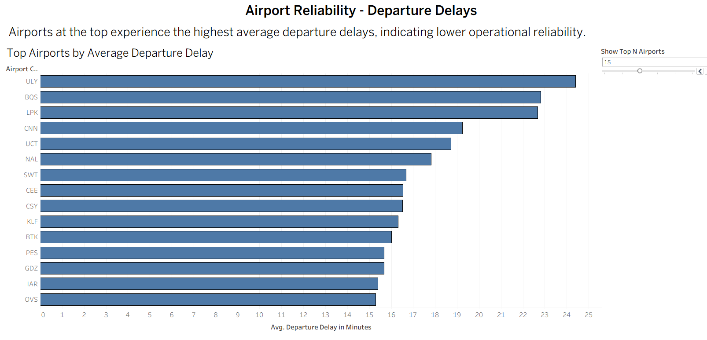
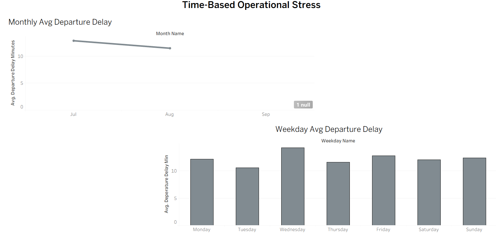
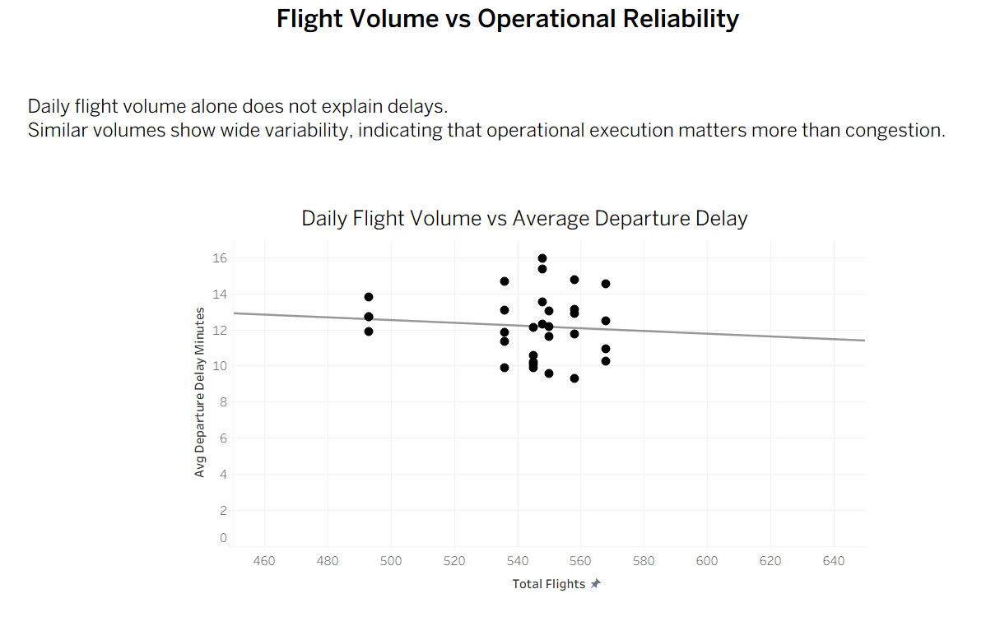
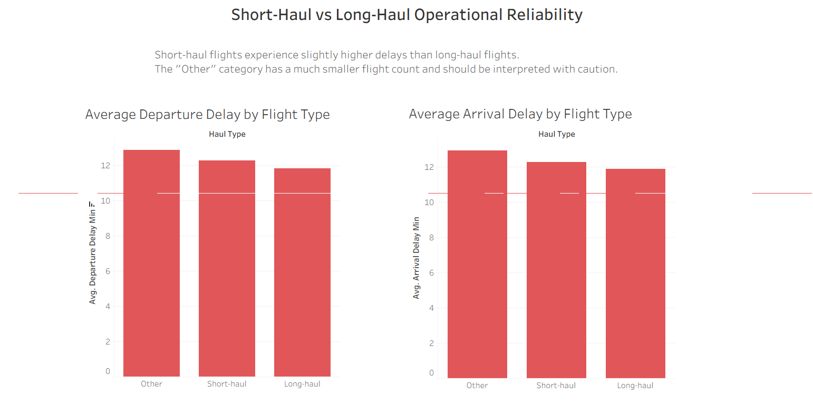

# Tableau Insights — Airline Operational Reliability Analysis

This document summarizes the key insights derived from the Tableau dashboards built on top of SQL-modeled KPI views.

The analysis focuses on operational reliability, not passenger behavior.

---

## 1. Which airports experience the highest average delays?

**Insight**
- A small set of airports consistently shows higher average departure delays.
- These airports are mostly regional or lower-volume airports rather than major hubs.

**Interpretation**
- Higher delays are likely driven by limited infrastructure, staffing constraints, or scheduling inflexibility.
- Departure delays are generally higher than arrival delays, indicating limited in-flight recovery.

**Business takeaway**
- Reliability issues are airport-specific and operational, not network-wide.

---

## 2. When are airline operations most stressed over time?

### Monthly pattern
**Insight**
- July shows the highest average delays.
- August has slightly lower delays despite similar or higher flight volumes.
- September contains mostly scheduled flights with no usable delay data.

**Interpretation**
- Peak summer travel increases operational stress.
- August performance suggests better planning or capacity adjustment compared to July.

### Weekday pattern
**Insight**
- Mid-week days (especially Wednesday) show slightly higher delays.
- Weekends are relatively stable.

**Business takeaway**
- Operational stress is seasonal and mildly weekday-dependent, not random.

---

## 3. Is higher flight volume associated with worse on-time performance?

**Insight**
- Daily flight volume remains relatively stable.
- Days with similar volumes show wide variation in average delays.
- The trend line indicates a weak or negligible relationship between volume and delay.

**Interpretation**
- High volume alone does not cause delays.
- Operational execution and disruption handling matter more than congestion.

**Business takeaway**
- Improving processes can reduce delays even during high-volume periods.

---

## 4. Do short-haul and long-haul flights differ in reliability?

**Insight**
- Short-haul flights experience slightly higher average delays than long-haul flights.
- Long-haul flights are marginally more reliable on both departure and arrival.
- Arrival delays closely match departure delays, showing consistency.

**Interpretation**
- Short-haul operations are more sensitive to airport-level constraints and turnaround pressure.
- Long-haul flights benefit from greater scheduling buffers and priority handling.

**Note**
- The "Other" category has a very small flight count and should be interpreted with caution.

**Business takeaway**
- Flight type influences reliability, but differences are moderate rather than extreme.

---

## Overall Conclusion

- Operational reliability is driven more by **execution quality** than by volume.
- Delays are concentrated in specific airports, seasons, and short-haul operations.
- SQL-modeled KPIs combined with Tableau provide a realistic view of airline operations.

This analysis reflects real world airline performance patterns and avoids overfitting or exaggerated claims.
