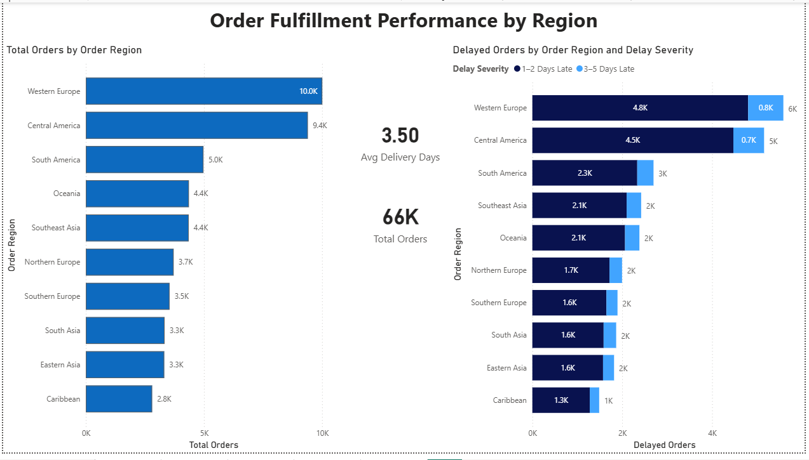
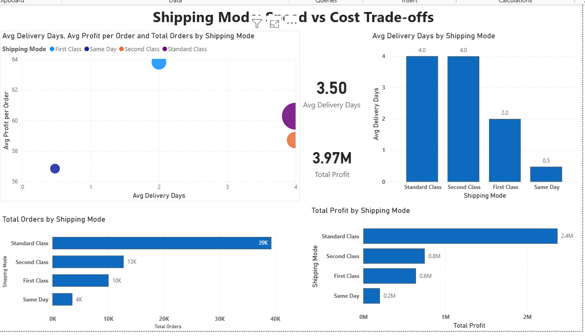
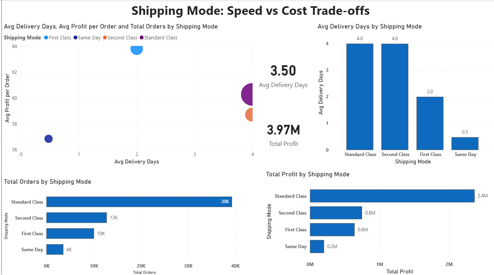
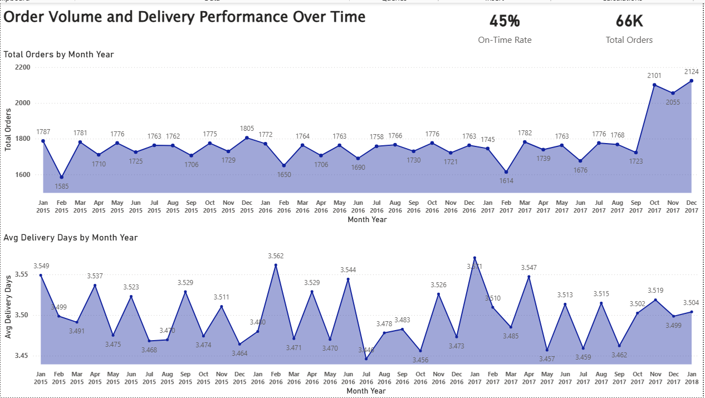
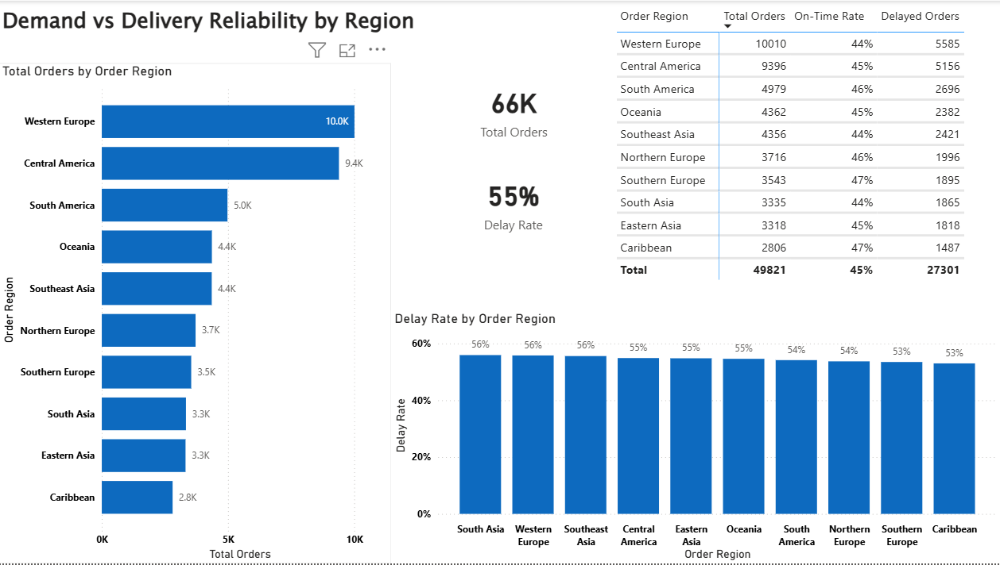

# Dashboard Insights

## Dashboard 1 — Order Fulfillment Performance by Region

### Purpose
This dashboard explores how order fulfillment performance varies across regions.  
The focus is on regions with higher order volumes, as fulfillment issues in these areas can have a larger overall impact.

### Key Metrics Used
- Total Orders  
- Average Delivery Days  
- Delayed Orders  
- Delay Severity (1–2 days late, 3–5 days late)

### Observations
- Order volumes are unevenly distributed, with a few regions handling a large share of total orders.
- Average delivery time is fairly consistent across regions, generally between 3 and 4 days.
- Regions with higher order volumes also show a higher number of delayed orders.
- Most delays fall in the 1–2 day range rather than more severe delays.

### Insights
- Delivery delays seem more related to order volume and capacity pressure than differences in delivery speed.
- High-volume regions may benefit from better capacity planning to reduce delays.
- Since delivery speed is similar across regions, improving reliability may be more important than improving speed.

### Notes on Design Choices
- Only top regions by total orders are shown to focus on higher-impact areas.
- A table is used for average delivery days because differences are small.
- A map is avoided, as bar charts provide clearer comparisons.

---

## Dashboard 2 — Shipping Mode: Speed vs Cost Trade-offs

### Purpose
This dashboard compares shipping modes to understand how delivery speed and profitability differ.  
The goal is to observe trade-offs between speed, usage, and profit.

### Key Metrics Used
- Average Delivery Days  
- Average Profit per Order  
- Total Orders  
- Total Profit

### Observations
- Shipping modes vary clearly in delivery speed.
- Standard Class handles the highest order volume and contributes the most to total profit.
- First Class combines relatively fast delivery with higher profit per order.
- Same Day delivery has low usage and low total profit contribution.
- Second Class is slower without a strong profit advantage.

### Insights
- Faster delivery does not automatically lead to higher overall profitability.
- First Class shows a reasonable balance between speed and profit per order.
- Standard Class is important due to high usage, despite slower delivery.
- Same Day delivery appears to be a niche option.

### Notes on Design Choices
- A scatter plot highlights speed vs profit trade-offs.
- Bubble size represents total orders to show usage.
- Bar charts support clearer comparison of volume and profit.

---

## Dashboard 3 — Impact of Delivery Delays on Profitability

### Purpose
This dashboard examines how delivery delays affect profitability, focusing on financial exposure rather than only delay counts.

### Key Metrics Used
- Total Profit  
- Delay Rate  
- Delay Severity  
- Delayed Orders by Region

### Observations
- A large portion of profit comes from delayed orders due to high delay frequency.
- 1–2 day delays account for most profit exposure among delayed deliveries.
- 3–5 day delays are less frequent but still contribute noticeable impact.
- Some regions show much higher delayed-order profit exposure.

### Insights
- Delays reduce reliability and increase operational risk even if profit remains.
- Mild delays collectively have a larger financial impact than severe delays.
- Regions with higher delayed-order exposure should be prioritized for improvement.

### Notes on Design Choices
- Delay severity is analyzed separately from on-time orders.
- Regional analysis focuses only on delayed orders to highlight risk.
- A table supports validation of visual insights.

### Learning Outcome
This dashboard helped show that total profit alone can hide the real impact of delivery delays.

---

## Dashboard 4 — Order Volume and Delivery Performance Over Time

### Purpose
This dashboard analyzes monthly trends in order volume and average delivery time.

### Key Observations
- Order volumes are mostly stable with gradual changes.
- A noticeable increase appears toward the end of 2017.
- Average delivery days remain close to 3.5 days throughout.
- Higher order volumes do not clearly increase delivery time.

### Insights
- Fulfillment performance appears consistent over time.
- The system seems able to handle demand changes without major delays.
- Minor fluctuations may indicate light seasonal effects.

### Why This Matters
- Time-based monitoring helps identify potential stress periods early.
- Stable performance supports long-term reliability.

---

## Dashboard 5 — Demand vs Delivery Reliability by Region

### Purpose
This dashboard compares regional demand with delivery reliability to identify high-demand regions with frequent delays.

### Key Observations
- Western Europe and Central America have the highest order volumes.
- These regions also show high delay rates.
- Other regions have moderate demand but similar delay levels.
- Delay rates are consistently high, generally between 53% and 56%.

### Insights
- Delivery delays appear to be system-wide rather than region-specific.
- High-demand regions face greater operational pressure.
- Improving reliability in these regions could significantly improve overall performance.

### Why This Matters
- High-demand regions with weak reliability pose risks to customer experience.
- Identifying these regions helps prioritize improvement as demand grows.
