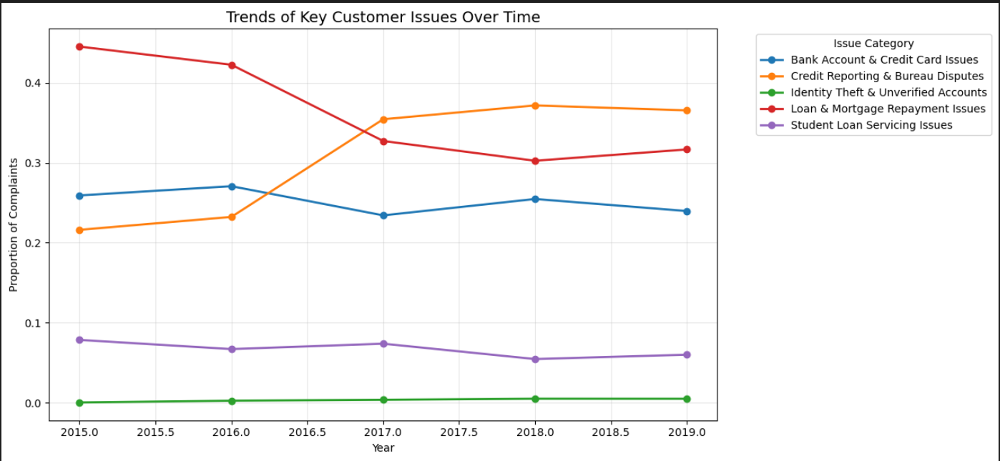
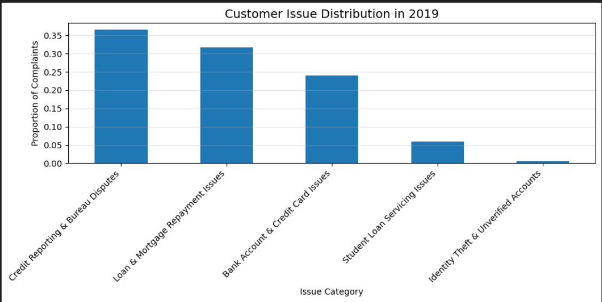

# Analysis Insights and Learnings

This document explains what I learned from analyzing customer complaint data, the modeling choices I made, and the limitations I faced while working on this project.

---

## Main Model Used for Analysis

Latent Dirichlet Allocation (LDA) was used as the main model for analysis.

LDA helped group complaints into clear and understandable topics, which made it easier to study how different customer issues changed over time.

Each complaint was assigned a dominant topic. This allowed complaints to be grouped by year and compared using topic proportions instead of raw complaint counts.

---

## Key Insights from Topic Analysis

### Credit Reporting and Bureau Disputes

- Complaints related to credit reports, incorrect information, and disputes with credit bureaus increased steadily over time.
- In the later years of the dataset, this became the most common complaint category.
- This suggests that customers are increasingly concerned about credit reporting accuracy and how disputes are handled.

### Loan and Mortgage Repayment Issues

- Loan and mortgage repayment complaints were very common in the earlier years.
- Over time, these complaints gradually declined.
- Although still present, their relative importance reduced, suggesting a more stable and mature issue category.

### Bank Account and Credit Card Issues

- Complaints related to bank accounts and credit cards appeared consistently across all years.
- These issues did not show strong growth or decline.
- This indicates ongoing operational problems rather than new or emerging risks.

### Student Loan Servicing Issues

- Student loan complaints appeared at lower volumes compared to other topics.
- These complaints remained fairly stable over time.
- While not dominant, they represent persistent issues affecting a specific group of customers.

### Identity Theft and Unverified Accounts

- Complaints related to identity theft and account misuse appeared in smaller numbers.
- Even at lower volumes, these issues are sensitive and potentially high impact.
- They remain important to monitor despite not being the largest category.

---

## Understanding Trends Over Time

To compare issues fairly across different years, trend analysis was done using topic proportions rather than raw complaint counts. This approach accounts for changes in the total number of complaints over time.

The chart above shows how different customer issue categories change in importance across years.

Overall, the trends show a clear shift in customer concerns:
- Traditional loan repayment issues became less dominant.
- Credit reporting and dispute related issues became more important over time.

The chart above highlights which customer issues dominate in the most recent year of the dataset.

---

## Using BERT Embeddings for Comparison

BERT sentence embeddings were explored as a deep learning alternative to topic modeling.

This approach grouped complaints based on overall meaning rather than word frequency. It handled narrative heavy complaints better, especially when similar issues were described using different language.

However:
- Many clusters overlapped because complaints often involve more than one issue.
- Clusters were harder to label clearly.
- The results were not suitable for time based trend analysis.

Because of these reasons, BERT embeddings were used only for comparison and not as the main analytical approach.

---

## Why LDA Was Kept as the Main Model

LDA was kept as the main model because:

- It produced clear and understandable topics.
- Topic assignments were stable across the full dataset.
- It allowed easy aggregation by year.
- Trend analysis was simpler to perform and explain.

Given the goal of understanding how customer issues change over time, LDA was the more practical choice.

---

## Assumptions Made

- Only complaints with available narrative text were included, since text content is required for NLP analysis.
- Minimal text preprocessing was applied to avoid changing the original meaning of complaints.
- Topic labels were assigned based on manual inspection of keywords and sample complaints.

---

## Constraints Faced

- The analysis was performed on a local CPU system, which limited the use of large deep learning models.
- The size of the dataset required sampling when working with BERT embeddings.
- No ground truth labels were available, so supervised evaluation was not possible.

---

## What Was Not Done

- No chatbot or interactive system was built.
- No model fine tuning or neural network training was performed.
- No deployment or dashboard was created.

These were intentionally excluded to keep the project focused on learning and analysis.

---

## Limitations

- Topic modeling is an unsupervised method and relies on human interpretation.
- BERT clustering results can change with different samples or clustering parameters.
- The analysis focuses on understanding trends, not on prediction or accuracy metrics.

---

## Key Learnings

- Classical NLP methods like TF-IDF and LDA are effective for exploring large text datasets.
- Deep learning embeddings capture meaning better but are harder to interpret.
- Choosing a model should depend on the problem, not just on model complexity.
- Clear reasoning and interpretation matter more than heavy optimization in exploratory NLP projects.
